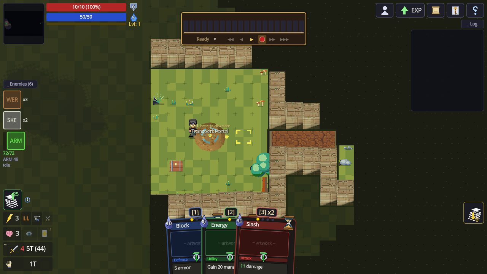
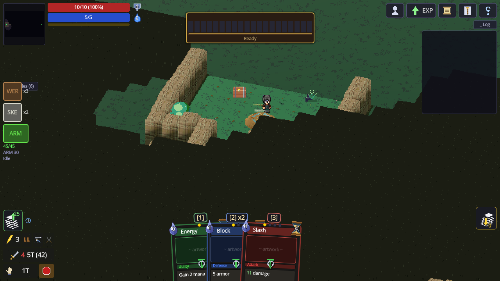
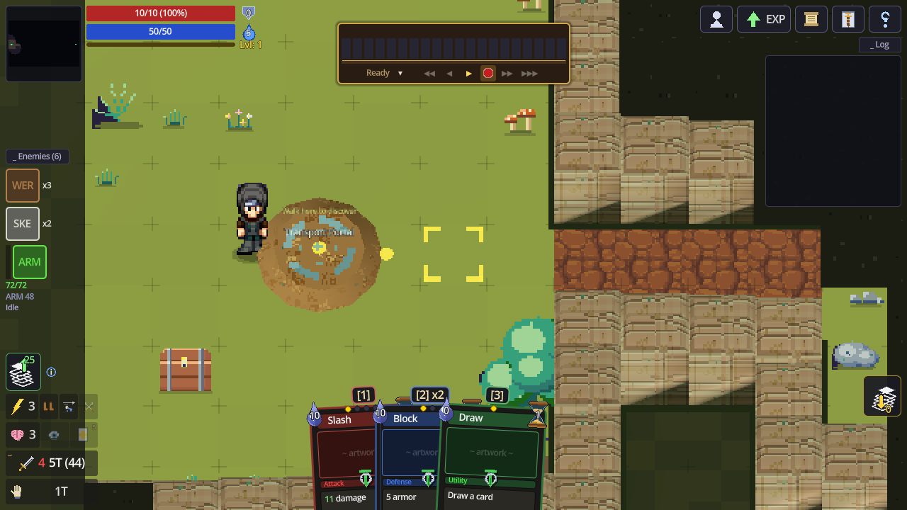
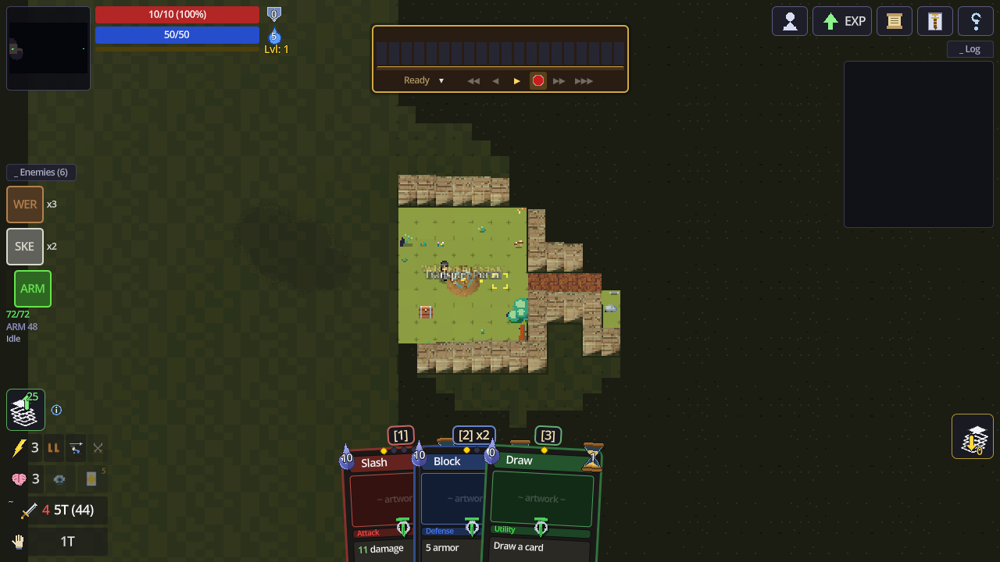
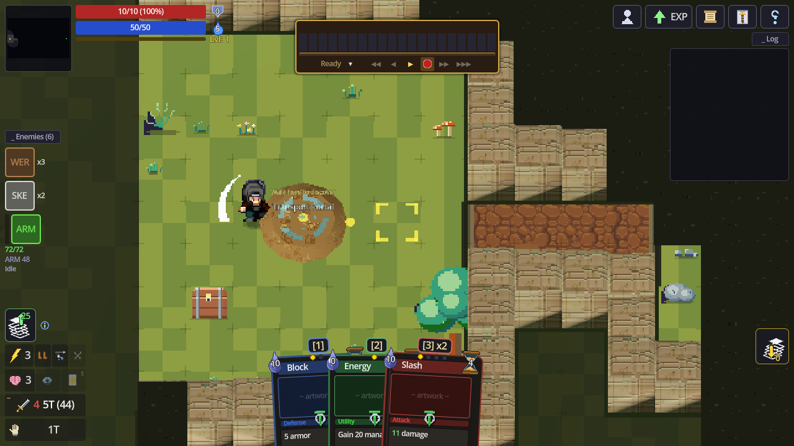
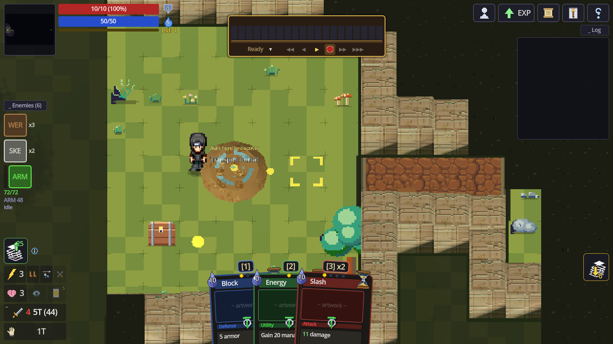
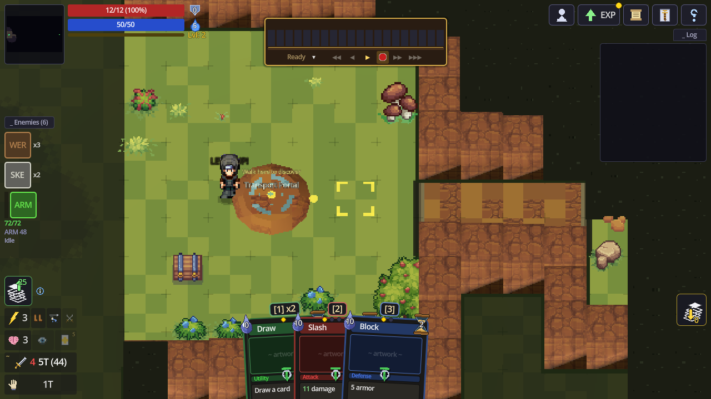

# Trials of Olorin

*Trials of Olorin* is a pseudo turn-based, card ARPG where the player adventures into different realms of the world. Throughout their journey, the player will develop a character making complementary decisions between their gear, deck, and innate abilities. From a massive brute wielding nothing but The Hammer of Ajax who becomes more devastating as he is wounded, to a studied scholar whose hand size takes up the screen, *Trials of Olorin* opens the door to an endless number of viable playstyles and builds.

*Trials of Olorin* is a **true RPG, not a roguelike**. There is no permadeath (besides hardcore), no run resets, no meta-currency loop. Your character's stats, deck, equipment, and progression are permanent and cumulative from the opening scene to the end of the story. Make decisions wisely.

## A look at the game

The battlefield is a fully 3D, elevation-aware grid rendered in pixel art — the camera orbits freely and zooms from close-up character work to a full tactical overview. Along the bottom: your hand of cards; top-center: the tempo bar that drives everything; left rail: the live enemy tracker.

| Default battle view | Orbited camera |
|---|---|
|  |  |

| Zoomed in | Zoomed out (tactical) |
|---|---|
|  |  |

Characters are procedurally animated — every card and action has real motion and effects, no canned videos:

| Basic attack mid-swing | Gathering a fireball | Level up (mist swirl + full restore) |
|---|---|---|
|  |  |  |

*(All shots are real frames from the running game — regenerate them any time with `tests/capture_screenshots.gd`.)*

Built in **Godot 4.6**.

---

## Table of Contents

1. [The Core Loop](#the-core-loop)
2. [The Home Base & The City](#the-home-base--the-city)
3. [The Tempo System](#the-tempo-system)
4. [Core Stats](#core-stats)
5. [Resources: Health, Mana, Armor](#resources-health-mana-armor)
6. [Cards](#cards)
7. [Card Effects & Keywords](#card-effects--keywords)
8. [Buffs](#buffs)
9. [Debuffs](#debuffs)
10. [Equipment & Inventory](#equipment--inventory)
11. [Weapon & Equipment Swapping](#weapon--equipment-swapping)
12. [Cards Slotted Into Items](#cards-slotted-into-items)
13. [Characters](#characters)
14. [Progression](#progression)

---

## The Core Loop

The game takes place on a grid system. You move your character tile by tile, draw cards over time, and play them against enemies in range. There are no discrete "your turn / enemy turn" phases. Instead, everything runs on a global clock system which progresses by the use of **tempo**. Playing cards, moving, and even waiting advances the clock. As the clock advances, enemies and the environment take their actions. Fighting well means strategically using time as a resource, not just mana or health.

Between fights you explore the world, complete quests, visit town vendors, manage your equipment and deck, and advance the story. There are _no_ battle scenes. All battles are live.
While progressing through the world, slaying monsters and developing your characters build, you are also collecting resources to send back to base.

---

## The Home Base & The City

*Trials of Olorin* is, at its heart, a **base builder**. The path of the game:

1. **Adventure & gather.** defeating enemies and completing quests add habitat-flavored resources to your satchel.
2. **Send it home.** The moment you return to town, your satchel is banked into the city stores. The first shipment founds the city and Olorin hands you a **bone-white flute** you'll come to know well.
3. **Build.** At the **Town Hall** you spend banked resources raising buildings: production (Lumber Mill, Quarry, Essence Extractor), storage (Warehouse), protection (Vault), military (Barracks, Walls), and hero support (Hero Hall).
4. **Defend.** A growing city draws eyes. Monster invasions and natural disasters build up while you adventure. You are never ambushed blind: when one strikes, **Olorin's flute sounds**, wherever you are. Return promptly and you stand with the garrison; linger and the city weathers it alone. Walls blunt disasters, the Vault shelters a share of your stores, and every attack is written into the city's chronicle.
5. **Repeat, forever.** After the story concludes, the end-game layers directly on top of this loop. Defend the city against escalating threats, farm the world's zones for XP, cards, items, resources, and keep building both the city and the character(s) who protect it. 

Your **card stash matters**: certain base events are easier with certain cards in your deck. Your core build stays your core build, however, a few smart swaps before answering the flute can turn a sack into a stand.

Recruited NPCs are part of the same fabric: allies found on the journey (starting with the Sellsword's battle-partners) return to town to staff and defend it. Eventually, multiple characters you've built will be able to reside in and defend the city.

---

## The Tempo System

**Tempo is the universal clock.** Basically every system in the game (enemy actions, mana regeneration, card draws, buff and debuff durations) is driven by it.

- Cards have a **tempo cost** alongside their mana cost. Playing a card schedules that many tempo **ticks**; the card's effect resolves on a specific tick (some cards hit immediately, some at the end of their wind-up).
- Cards you play queue **sequentially**. Your second card starts ticking after your first finishes. In co-op, each character has their own queue but uses the same global ticker. Meaning players act simultaneously, play cards independently, while utilizing the same tempo bar.
- **Playing an action commits you.** While your own card or basic attack is ticking down, you are glued to your position — no movement until your ticks run out. That is the price of tempo.
- **The action queue is visible and partially reversible.** The ▾ arrow beside the tempo bar opens your queue (last 15 actions). An action whose tempo hasn't started yet carries a red ✕ — cancel it and the card returns to your hand with its tempo AND mana fully refunded. Once an action's own ticks begin, it is locked in. Queue five attacks, take a beating, cancel the three that haven't started, and run.
- By default, **movement costs 1 tempo per tile**.
- Every **5 global tempo = 1 cycle**. Cycles are the game's heartbeat:
  - Mana regenerates once per cycle.
  - Armor decays once per cycle.
  - Buffs and debuffs tick down once per cycle.
  - Per-cycle effects (regen, poison, burn, etc.) trigger or decrease.
- By default, **card draws** trigger every 25 tempo (5 cycles).

Because enemies act on tempo, a cheap fast card and an expensive slow card dictate how the game will play out. **ENEMIES CAN TAKE MULTIPLE ACTIONS IN A ROW.** In other words, if you play a card worth 8 tempo, while it ticks, an enemy who attacks every 4 tempo will hit you twice.

---

## Core Stats

Every character has six core attributes:

| Stat | Effect |
|---|---|
| **Strength (STR)** | +0.5 melee damage per point. +10 carry capacity per point. Spare capacity also weighs (hehe) into your attack-speed counter. Inversely, being close to your capacity will slow it down. |
| **Dexterity (DEX)** | The primary attack-speed stat. Every (45 − 0.5 × DEX) attacks (through a card or your auto attack) triggers an **attack speed proc**: your next attack costs **half tempo and 2 less mana**. The counter bottoms out at 1. Additionally, every 1 point in DEX increases **crit damage by 3%**. |
| **Intelligence (INT)** | +0.5 spell and heal power per point. +0.15 mana regen per point (about +1 per 7). |
| **Wisdom (WIS)** | +1 hand size for every 5 points. Every 4 points draw your next card 1 tempo sooner. |
| **Determination (DET)** | Controls how low health affects your other stats. At 15 it does nothing. Above 15, your stats *climb* as your health drops; below 15, they *fall*. The lower your health, the bigger the swing. roughly ±0.1% per point at 80% HP, ±0.25% at 60%, ±0.6% at 40%, and ±1% at 10% HP or below.|
| **Agility (AGI)** | Grants **Flash points**: 1 per AGI point, refreshed every 3 cycles (15 tempo). Spending them is a choice: **3 points** move a tile without spending tempo, **3 points** buy 2 block (**2 points** with a free hand), **5 points** advance the attack-speed counter one tick. Without Flash, each tile moved costs 1 tempo. |

All characters share a base **5% critical hit chance** and **110% critical damage**. Crit chance is raised only by items, cards, and other effects. No stat affects it. As previously mentioned, crit damage scales with Dexterity.

---

## Resources: Health, Mana, Armor

### Health
Your life total. Every character starts the story with **10 health** and gains **+2 max health every level**. **There is no pure vitality stat to increase health**. Reaching 0 means dead sauce. Healing is boosted by Intelligence and equipment.

### Mana
The cost of playing most cards.

- Regenerates on a tempo system. Influenced by the intelligence stat.
- **Power cards with Maintain reserve mana** from your pool while their effect persists. Reserved mana doesn't regenerate back until the card is dismissed or broken.
- If your mana ever hits 0, **all maintained cards break** and are discarded at once.

### Armor
Damage absorption that sits in front of your health.

- Incoming damage is absorbed in order: **armor → temporary HP → health**. Armor is always the first line of defense; items, nodes, enemy attacks, or cards may manipulate this order.
- Armor **decays 2 per cycle** by default. Some effects (Fortify) pause decay; others (Brittle) accelerate it.

---

## Cards

Your deck is your moveset. Cards move between several zones during combat:

- **Draw pile** — face-down deck. When empty, the discard pile shuffles back in.
- **Hand** — cards you can play. Hand size = 4 + Wisdom bonus + equipment bonuses.
- **Discard pile** — where played and discarded cards go, awaiting reshuffle.
- **Jail** — cards locked away for a set amount of tempo. Jailed cards can't be played; when their time expires they're released to the discard pile.
- **Maintained** — active Power cards sit here, reserving mana.
- **Manifest zone** — cards converted into clickable tokens by certain in game circumstances.

### Card types

| Type | Behavior |
|---|---|
| **Attack** | Deals damage. Melee by default; ranged attacks have base range 5. |
| **Defense** | Grants armor or blocks. |
| **Utility** | Draw, healing, movement, buffs, support effects |
| **Power** | Persistent effect with a **Maintain** cost that reserves mana while active. |
| **Reaction** | Triggers automatically from your hand when its condition is met. |
| **Enchantment** | Cannot be played. Provides a passive buff *while in your hand*, then auto-discards after 2 cycles. |
| **Unplayable** | Dead weight and takes up a hand slot. Usually inflicted by enemies. |

### Drawing and overflow

If a draw would exceed your hand size, it **overflows**. **By default, nothing happens**. You simply don't draw the extra card and it stays on top of your draw pile. Cards and items can set an active *overflow mode* that instead does something with the overflowing card.:

| Overflow mode | Result |
|---|---|
| **Jailed** | The card goes to jail and can't be played until its sentence expires. |
| **Enhance** | Attack cards gain bonus damage, then are discarded. |
| **Peak** | You see the next card on the draw pile. |
| **Skip** | The card is sent straight to the discard pile. |
| **Overcharge** | Triggers a special effect on each overflow (ie: heal 4 on overflow, gain 2 armor on overflow, deal 2 damage to a random enemy etc. |
| **Manifest** | The card becomes a token in the manifest zone. |

---

## Card Effects & Keywords

Mechanics that appear on cards:

| Keyword | Meaning |
|---|---|
| **Maintain X** | Reserves X mana while the card's effect persists. Breaks if mana hits 0. |
| **Sticky X** | Card stays in hand and can be played X times before discarding. |
| **Erase** | The card is permanently deleted from your deck — either after X tempo, or immediately after being played. |
| **Glut X** | You cannot play cards for X tempo after this one. |
| **Delay X** | The effect takes place X tempo after playing. |
| **On-Draw / On-Discard** | Triggers an effect when drawn / discarded. |
| **In-Hand** | Applies a persistent effect while the card sits in your hand. |
| **Linger** | Status card that can exceed your hand size limit. While it lingers, normal draws overflow. |
| **Empower** | Affects your next cards: +3 damage for attacks, −3 block for defense. |
| **Reach** | Adds 1 tile to melee attack range. |
| **AOE** | Hits multiple targets in a shape (cone, circle, or line). |
| **Chisel** | Card can only be played while slotted into an item — never from hand alone. |

Some cards carry **RNG outcomes**. When the **card is drawn** the player is told if the card will be successful or a failure. **Holding the card for a certain amount of tempo will re roll this outcome**. The player will see the new outcome as well. Chance-boosting effects tilt these rolls in your favor.

---

## Buffs

Positive effects. Duration-based buffs tick down each cycle; charge-based buffs deplete as they're used.

| Buff | Effect |
|---|---|
| **Thorns** | Deal X damage back to attackers. |
| **Focused** | Gain 1 extra mana per cycle. |
| **Regen** | Heal X HP per cycle. |
| **Blessed** | Draw X additional card(s) per cycle. |
| **Fortify** | Armor does not decay. |
| **Enlightened** | +X% crit chance for the next Y attacks. |
| **Strengthen** | +X damage on the next Y attacks. |
| **Bolster** | +X armor the next Y times you gain armor. |
| **Haste** | Your next move command travels X extra tiles. |
| **Cleanse** | Remove X negative effect(s) instantly. |
| **Smith** | Gain X armor per cycle. |
| **Steady** | Your next action adds no tempo. |
| **Brace** | Reduce incoming attack damage by X% for Y attacks. |
| **Resilient** | Reduce all incoming damage by X% for Y tempo (can be limited to one damage type). |
| **Life Steal** | Your next attack heals you for the damage dealt. |
| **Morphine** | Gain temporary HP; when it expires, lose it and take 2 damage. |
| **Wear Down** | Each of your attacks reduces the target's attack by 1 (stacking). |
| **Invisible** | Cannot be targeted by enemies. |
| **Armor Break** | Next attack deals double damage to armor only (no health damage). |
| **Shield Ready** | Gain X armor after Y tempo. |
| **Repelled Block** | If the next melee attack is fully blocked by armor, negate it and knock the enemy back 4 tiles. |
| **Shield of Growth** | All damage taken increases your armor by that amount. |
| **Phoenix Grace** | When HP drops below 50%, heal to 80% and apply 5 burn to the nearest enemy. |
| **Demonic Rage** | Your next X mana costs are paid with health instead. |
| **Poisoned Blood** | Your heal cards deal damage to enemies instead of healing. |
| **Elixir** | Poison ticks heal you instead of damaging you. |

---

## Debuffs

Negative effects, applied by enemies and hazards (and occasionally self-inflicted by powerful cards).

| Debuff | Effect |
|---|---|
| **Bleed** | Take X damage per tile moved. |
| **Stun** | Cannot take any actions. |
| **Disarm** | Cannot play attack cards. |
| **Silence** | Cannot play spell cards. |
| **Burn** | Damage doubles each cycle (1, 2, 4, 8…). |
| **Poison** | Take X damage per cycle; lose 1 stack per cycle. |
| **Inebriate** | Movement direction is randomized. |
| **Cursed** | Deal 20% less damage, and deal 20% of your damage to yourself. |
| **Frozen** | Cannot play cards. |
| **Cuffed** | Cannot draw cards. |
| **Shocked** | Deal X damage to nearby allies per cycle; loses 1 stack per cycle. |
| **Slowed** | Each move command travels X fewer tiles (never below 1). |
| **Staggered** | Attack cards cost X more mana. |
| **Drain** | Lose 1 mana per cycle; loses 1 stack per cycle. |
| **Weighted** | Cards cost X more tempo. |
| **Hexed** | One random card in hand costs +X mana. |
| **Locked** | One random card in hand cannot be played. |
| **Rooted** | Cannot move. |
| **Tethered** | Cannot move more than X tiles from where it was applied. |
| **Magnetized** | Pulled X tiles toward the nearest enemy each cycle. |
| **Linked** | Share X% of damage taken with your ally (co-op partner). |
| **Clumsy** | X% chance to discard a random card whenever you play one. |
| **Vulnerable** | Take 30% more damage on the next X attack(s). |
| **Exposed** | Your armor absorbs 30% less damage. |
| **Brittle** | Armor decays an extra 2 per cycle. |
| **Cold** | Stacking. At 5 stacks, become Frozen. |
| **Blind** | X% chance for your attacks to miss. |

---

## Equipment & Inventory

### Slots

Characters equip items into typed slots: **Helm, Chest, Rings, Belt, Boots, Gauntlets, Weapons/Hands**. Quivers occupy a hand slot. Slot counts vary by character (see [Characters](#characters)).

Items grant stat bonuses, resource bonuses, hand size, weapon damage, and special effects. Each item has a general theme, although they do not always follow them specifically.

### Rarity & drops

Every item — weapons and armor alike — has one of five rarities:

| Rarity | Color | Max level |
|---|---|---|
| **Basic** | Gray | 2 |
| **Common** | Green | 2 |
| **Rare** | Blue | 2 |
| **Legendary** | Orange | 3 |
| **Mythic** | Purple | 3 |

**Only level-1 items ever drop** — higher levels exist exclusively through the Blacksmith's Forge (below).

What drops depends on the source. Tougher enemies skew toward better loot (weights, roughly percentages):

| Source | Basic | Common | Rare | Legendary |
|---|---|---|---|---|
| Trash enemies | 62 | 30 | 8 | — |
| Mid-tier enemies | 45 | 33 | 18 | 4 |
| Elites | 20 | 35 | 35 | 10 |
| Bosses | — | 20 | 55 | 25 |
| Chests | 54 | 30 | 12 | 3 (+1 mythic) |

**Mythics play by their own rules.** Outside of the rare chest roll, mythics never come from the regular loot table — they come from the per-act **pity system** ("mythic creep"): each act all-but-guarantees one mythic per character. Until it drops, every story kill raises the chance (starting at 0.2%, +0.05% per kill — it typically lands around kill 60 and is near-certain by 150). Once the act's mythic has dropped, mythic chances return to a small per-kill baseline (mid 0.2%, elite 1%, boss 5% — trash enemies never roll one). **Act 1 is the exception:** after its one guaranteed mythic, act 1 never drops another for that character, chests included.

The tuning target: a full story playthrough yields on the order of **1,000 item drops** and around **10 mythics** — enough to forge one mythic to Lv.3 while keeping spares for the build.

### Item levels & the Forge

Items are upgraded at the town Blacksmith's **Forge** by consuming spare copies of the same item:

- **Basic / Common / Rare** items reach **Lv.2** by consuming **3 spare copies** (4 found in total).
- **Legendary / Mythic** items reach **Lv.2** with **1 spare copy** (2 found), and **Lv.3** with **2 more** (4 found in total).

What a level does:

- **Lv.2 — a stat boost.** damage, stats, armor, health, and so on.
- **Lv.3 — a transformation** (legendary/mythic only). The item's baked-in skill, granted cards, on self abilities, are potentially rewritten into a stronger form.

Forge rules: the upgrade target and all copies must be **unequipped** (inventory or stash), and copies must be level 1. A copy currently holding a card **you slotted into it** can't be used to forge until you extract the card at the Blacksmith. Empty card slots are fine, and cards an item **grants on its own** never block forging.

**Mythic Molds**: mold **two spare level-1 mythics** down into one **Mythic Mold**. Redeemable at the Blacksmith for a fresh copy of **any mythic you have owned before** (never an unfound one). Seven mythic drops therefore guarantee a Lv.3 mythic of your choice.

### Weight & carry capacity

Every item has weight. Your capacity is **50 + 10 per point of Strength**. You cannot take an action that pushes you (further) over capacity, and carrying close to your limit slows your attack-speed procs while traveling light speeds them up (both capped). **Total carrying weight is used when understanding attack speed, not just weapon weight.**

### Hands, off-hands, and two-handing

- Weapon slot 1 is your main hand; additional hand slots are **off-hands**, which apply their bonuses at reduced (90%) effectiveness by default.
- **Any item can go in any hand** — there is no main-hand/off-hand *type* restriction. You can wear a shield in your main hand and a sword in an off-hand, a quiver alongside a bow, and so on. The 90% off-hand reduction is about *which slot* an item sits in, not what type of item it is.
- **Dual wielding carries a weight tax.** Holding a pair of weapons, or a pair of **shields**, makes **every** item of the pair count **15% heavier** toward your carry load but the attack-speed counter drops by **4**. The penalty hits both hands, so a huge main-hand weapon can't hide behind a feather-light off-hand. Twin daggers barely notice while pairing two real weapons is a Strength commitment. Sword-and-shield mixes classes and doesn't count as dual wielding.
- **The free hand.** Wielding exactly one hand item, weapon **or** shield, with your other hand truly empty is a stance of its own. This comes with the benefit of flash **parry costs 2 instead of 3**, and **every 12th attack echoes**. The echo is free and does not advance the attack-speed counter and can't itself echo. The two-handed grip fills both hands and a quiver occupies a hand, so neither qualifies.
- **Exception — bows are two-handed.** A bow never shares the hands with another weapon or shield.
- **Any weapon or shield can be gripped with both hands** — it's a player choice per slot, not an item property. Two-handing:
  - halves the item's carried weight (letting a weaker character wield huge gear),
  - drops your **total** carry capacity to 70% while gripped,
  - consumes a second (empty) hand slot,
  - grants bonus damage from the item's *original* weight (+1 per 25 weight) — shields instead gain bonus block armor.

### Equipment builds (loadouts I / II / III)

You can save **three equipment builds** and switch between them. Switching swaps every changed piece at once and re-applies your two-handed grip. **Every changed slot costs tempo**:

| Slot | Swap cost (tempo) | Remove-only |
|---|---|---|
| Helm, Ring, Hand items | 2 | 1 |
| Gauntlets, Belt, Boots | 3 | 1 |
| Chest | 8 | 4 |

The switch validates the end state as a whole (weight, storage space) before anything moves — you'll never get stranded half-dressed.

### Storage & stash

Unequipped gear lives in your backpack (limited slots). Towns provide a larger persistent **stash**. Loose cards you pick up as loot also are added to your inventory. When adding them to your deck, via directly or an item slot, the card is put into your discard pile.
---

## Weapon & Equipment Swapping

Items and cards are deeply linked: some items **grant cards** to your deck while equipped, and cards can be **slotted into items** (see next section). Swapping equipment moves those cards with the item:

- **Equipping an item** places the cards it owns into your **discard pile** — they join your deck on the next reshuffle, not instantly in hand.
- **Removing an item** immediately pulls its cards out of **every zone** — deck, hand, discard, jail, maintained, and manifest.
- **Jail time is not laundered by swapping.** If an item's card is jailed and you swap the item out and back in, the card returns *directly to jail* with the same time remaining.
- **Produced cards detach.** If an item or a slotted card *generates* a card during play (for example, a goblet that produces a Heal Orb card), that produced card belongs to you, not the item. It stays in your deck even after the item is swapped out.

---

## Cards Slotted Into Items

Items with card slots can have cards **Enchanted** into them (and **Extracted** back out). A slotted card stays playable in your deck, but gains the item's **On-Self bonuses** when played.

Slotting is governed by compatibility keywords:

| Keyword | Meaning |
|---|---|
| **Pliable** | Card can be slotted into any item type. (Default) |
| **Picky** | Once extracted from an item, the card can only be re-slotted into the *same item type*. |
| **Molded** | Card is permanently locked into the item and cannot be extracted. |
| **Arrow** | Bow/quiver cards. |
| **Pocket** | Slots into belts. Generally daggers, potions, or other small items. |
| **Gem** | Slots into rings. |
| **Swift** | Slots into boots. |
| **Buckler** | Slots into shields. |
| **Crown** | Slots into helms. |
| **Fist** | Slots into gauntlets. |
| **Chisel** | Card is *only* playable while slotted in an item. |

---

## Characters

Five playable characters. All of them:

- start with the **identical basic deck** (4 Slash, 4 Block, 1 Draw, 1 Energy, 1 Heal) — no character-specific starting cards,
- start with **no equipment** — every item is found, bought, or earned in the world,
- allocate the same starting stat pool,
- have **one item specialty**: a slot layout that favors a particular equipment type (e.g. Brad's chest pieces weigh 20% less and Ryan gets −1 mana cost on belt cards),
- have a **unique passive** tied to their specialty,
- have **four distinct paths** of abilities that can be **mixed and matched**. You are never locked into a single path; your build can borrow from all four.

**All cards are neutral** — no card is restricted to a particular character. Skill trees may still grant specific cards as level-up options, but any card a character can obtain, any other character can use. Character identity comes from the intersection of item specialty, path choices, stat allocation, and the deck you assemble.

---

## Progression

Your character grows along several permanent axes:

- **Levels & XP** — combat grants experience. Every level grants **+2 max health and +3 stat points**, banked until you spend them from the skill tree screen.
- **Stat allocation** — 8 points at character creation, then 3 per level; core stats are yours to distribute and shape around Determination's risk/reward curve.
- **Sphere grid** — a 100+ node unlock web spent with spheres earned on level-up. Beyond stat nodes, combat bonuses (crit, thorns, life steal, resistances, etc.), and passives, it carries:
  - **Keystones** — nodes that truly define builds. These nodes manipulate *how you play the game*: for instance, using mana as health, gaining bonus uses for flash points, and only receiving temp health instead of healing. A character can attach at most **3 keystones** — choose the ones that define your build.
  - **Null nodes** — small connectors that grant nothing; the toll paid on the road to something bigger.
  - **Constellations** — completing certain node patterns grants an extra bonus. A node can only be connected to one constellation, so choose wisely.
- **Path abilities** — each character has 4 "paths" that provide unique passives (e.g. Cory: Monk, Druid, Lurker, and Atrophist).
- **Deck crafting** — buy cards from vendors, and use consumables to sculpt the deck:
  - **Culling Stones** permanently remove a card from your deck.
  - **Paper Feathers** — a card-crafting consumable (their new role is being redesigned).
  - **Origami Swans** are earned by destroying cards; 20 swans convert into a Paper Feather.
- **Equipment** — loot, vendors, and quest rewards across all acts.
- **Story** — a four-act journey (Earth → Hell → Heaven → a final return to Earth). Everything above carries forward between acts; nothing resets.

- **The home base** — every kill feeds the city you're building back in town, and the end-game is defending and growing it. See [The Home Base & The City](#the-home-base--the-city).
